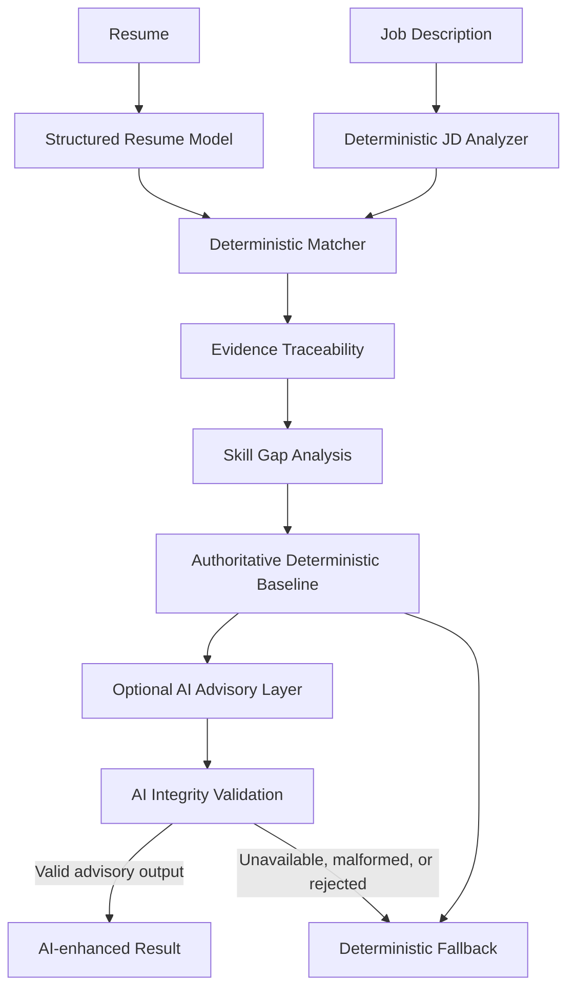

# Resume Intelligence

Resume Intelligence is an evidence-grounded resume and job-description analysis workspace. It helps you structure a resume, compare it with a target role, inspect the exact evidence behind each result, understand skill gaps, and optionally request advisory AI insights—while keeping deterministic analysis authoritative and AI strictly advisory.

> **Make every claim defensible.**

[GitHub repository](https://github.com/notcoderhuman/my-resume-builder)

## What it does

Resume Intelligence separates what a job asks for from what a resume actually supports. It does not treat a keyword as proof by itself, and it does not let optional AI rewrite the authoritative result.

The workspace includes:

- A structured resume editor with repeatable experience, education, project, and certification records
- Local persistence for resume data and the entered Job Description
- Legacy resume-data migration into the structured model
- Deterministic Job Description parsing with source text and requirement traceability
- Deterministic resume-to-job matching
- Requirement-level statuses and confidence values
- Evidence traceability from job requirement to resume source path and text
- Deterministic skill-gap analysis and priority guidance
- Stale-analysis invalidation when resume or Job Description data changes
- PDF export with safe clickable links and pagination helpers
- Optional AI advisory insights through Ollama, Gemini, or the test mock provider
- AI output integrity validation and deterministic fallback when output is unavailable, malformed, or unsafe
- Responsive layouts for desktop and mobile screens
- Keyboard-accessible controls, visible focus states, reduced-motion support, and reduced-transparency fallback

## Why the deterministic baseline comes first

The deterministic baseline is the authority. It produces the score, statuses, evidence mappings, and skill-gap results from the structured resume and parsed Job Description.

AI is an optional second layer. It may explain or prioritize information already present in the deterministic result, but it is not allowed to invent:

- Resume evidence
- Experience or employers
- Metrics
- Skills or technologies
- Unsupported responsibilities
- Years of experience
- Source paths or requirement IDs

This separation makes the result inspectable. A user can follow a status back to the requirement and the resume text that supported it, rather than accepting an unexplained AI judgment.

## How it works



In practical terms:

1. Enter resume information in the structured editor.
2. Paste a target Job Description.
3. The analyzer extracts explicit requirements and preserves their source text.
4. The matcher compares those requirements with indexed resume evidence.
5. Evidence and skill-gap views explain the result without changing the underlying data.
6. Optional AI can add advisory interpretation after the deterministic result exists.
7. Invalid or unavailable AI output falls back to the deterministic baseline.

## Running locally

Resume Intelligence currently runs locally. Follow the Quick Start guide below to launch it at:

<http://localhost:3000>

Repository: <https://github.com/notcoderhuman/my-resume-builder>

## Quick start

### Prerequisites

- [Node.js](https://nodejs.org/) 18 or newer
- npm, included with Node.js
- [Git](https://git-scm.com/)

### Install and run

Open PowerShell, Terminal, or a similar shell:

```bash
git clone https://github.com/notcoderhuman/my-resume-builder.git
cd my-resume-builder
npm install
npm start
```

Open the application at:

<http://localhost:3000>

The server reads `PORT` when provided and otherwise uses port `3000`. For example, in PowerShell:

```powershell
$env:PORT="3001"
npm start
```

Then open <http://localhost:3001>.

## Using the app

1. Open **Resume** and enter the information you can support.
2. Open **Job description** and paste a target role description.
3. Run the deterministic baseline analysis.
4. Open **Match analysis** to review the score and requirement-level results.
5. Open **Evidence** to trace each requirement to Job Description text and resume source paths.
6. Open **Skill gaps** to see deterministic improvement guidance.
7. Optionally request AI advisory insights when a provider is configured.
8. Return to **Resume** and export a PDF when the document is ready.

### Result meanings

- **Supported:** direct normalized evidence for the requirement was found in the resume.
- **Partial:** genuine related resume evidence exists, but it does not explicitly demonstrate the full requirement.
- **Not demonstrated:** no supporting resume evidence was found. This does not claim that the user lacks the skill; it means the current resume does not demonstrate it.

Changing the resume or Job Description invalidates current analysis results so stale evidence, gaps, and AI insights are not presented as current.

## Optional local AI with Ollama

Ollama is optional. The deterministic analyzer, matcher, evidence view, and skill-gap analysis work without AI.

Ollama runs the model on the local machine. The default model used by the application is:

```text
qwen2.5:3b
```

The default local endpoint is:

```text
http://127.0.0.1:11434
```

### Windows PowerShell setup

Install Ollama from the [official Ollama website](https://ollama.com/), then use PowerShell:

```powershell
ollama serve
ollama list
ollama pull qwen2.5:3b
```

In the terminal where you will start the application, configure the provider:

```powershell
$env:AI_PROVIDER="ollama"
$env:AI_MODEL="qwen2.5:3b"
$env:OLLAMA_BASE_URL="http://127.0.0.1:11434"
npm start
```

These environment variables apply only to the current PowerShell session. Start Ollama in another terminal if `ollama serve` occupies the first one.

In **Settings**, the application reports whether the configured local model is available. If Ollama is unavailable, the deterministic baseline remains usable and AI requests fall back safely.

### Optional Gemini provider

Gemini is also implemented as a server-side provider. Configure it without placing the key in browser code:

```powershell
$env:AI_PROVIDER="gemini"
$env:AI_MODEL="gemini-2.5-flash"
$env:AI_API_KEY="your-api-key"
npm start
```

`GEMINI_API_KEY` is supported as a fallback environment-variable name. Never commit a real key.

For local UI testing without a network provider, the implementation also supports `AI_PROVIDER="mock"`.

## Data and privacy model

- Resume data is persisted in the browser under the project’s local storage approach.
- The Job Description text and the existing structured Job Description model are also persisted locally so the input survives view changes and refreshes.
- If browser local storage is unavailable, the application uses an in-memory fallback for the current session.
- Legacy flat resume data is migrated into the versioned structured resume model.
- AI is optional. Without a configured provider, deterministic analysis continues to work.
- With Ollama configured, inference is sent to the local Ollama endpoint on the same machine.
- With Gemini configured, requests may be sent to the configured Gemini provider using the server-side API key.

Local browser persistence is not a substitute for a server account, encrypted backup, or organization-wide data-retention policy.

## Security and integrity

The repository includes application-level protections that support the evidence-first design:

- User-controlled browser-rendered text is escaped before insertion into HTML.
- Structured resume and Job Description source paths are resolved against current data.
- Unknown or tampered requirement IDs, source paths, and source text are rejected by integrity validation.
- AI prompts explicitly label resume, Job Description, match, and gap data as untrusted data rather than instructions.
- AI output is validated against deterministic IDs, statuses, evidence paths, and source text.
- Unsupported AI claims and unsafe improvements are rejected.
- Deterministic fallback is returned when AI is unavailable or its output fails validation.
- Express JSON payloads have a `100kb` limit, and Job Descriptions have a `100,000` character limit in the browser flow.
- The server sets Content Security Policy, `X-Content-Type-Options: nosniff`, `Referrer-Policy: no-referrer`, and `X-Frame-Options: DENY` headers.
- Express `X-Powered-By` is disabled.
- Ollama endpoints are restricted to local loopback HTTP hosts to prevent remote endpoint configuration.
- Resume links are restricted to HTTP and HTTPS URLs before export/rendering.

These are implementation protections, not a formal security audit or certification.

## Architecture and project structure

| Path | Purpose |
| --- | --- |
| `index.html` | Main Resume Intelligence application shell and view markup |
| `style.css` | Application visual system and responsive styles |
| `script.js` | Browser state, editor bindings, local persistence, rendering, analysis orchestration, and PDF export helpers |
| `server.js` | Express server, static serving, analysis APIs, AI status, and provider-facing routes |
| `lib/` | Structured models, Job Description parsing, matching, evidence integrity, skill-gap analysis, storage, and AI intelligence modules |
| `public/` | Legacy Evidence Vault static bundle retained for compatibility routes |
| `tests.js` | Node-based unit and integration test suite |
| `playwright/` | Browser workflow tests |
| `package.json` | Project metadata, dependencies, scripts, and Node.js engine requirement |
| `package-lock.json` | Locked npm dependency tree |
| `LICENSE` | MIT license text |

## Tech stack

| Area | Technology |
| --- | --- |
| Frontend | HTML, CSS, vanilla JavaScript |
| Backend | Node.js, Express |
| AI providers | Ollama, Google Gemini, local mock provider |
| Persistence | Browser `localStorage` with in-memory fallback; server JSON storage for legacy evidence routes |
| Testing | Node test harness, Playwright |
| PDF/export | jsPDF, html2canvas, browser-safe link annotation helpers |

## Design philosophy

- **Evidence before claims:** every important result should be traceable.
- **Deterministic baseline first:** matching and gap results are calculated before optional AI interpretation.
- **AI advisory second:** AI can explain or prioritize, but cannot become the source of truth.
- **Graceful fallback:** unavailable or rejected AI output does not prevent deterministic use.
- **Local-first where appropriate:** resume and Job Description inputs persist in the browser by default.
- **Accessible and responsive:** the UI retains keyboard access, visible focus, reduced-motion support, and mobile layouts.

## Testing

Run the Node suite:

```bash
npm test
```

Run the browser workflows:

```bash
npm run test:browser
```

The current release was verified at the time of writing with 125 Node tests and 3 Playwright browser tests. The exact count may change as coverage evolves; the commands above are the source of truth.

## Troubleshooting

### `npm` or `node` is not recognized

Install Node.js 18 or newer from [nodejs.org](https://nodejs.org/), reopen your terminal, and run:

```bash
node --version
npm --version
```

### Ollama is unavailable

Start Ollama in a separate terminal:

```powershell
ollama serve
```

Then check that the model exists:

```powershell
ollama list
```

### The model is missing

Download the configured default model:

```powershell
ollama pull qwen2.5:3b
```

Then start the app in the same session where the Ollama environment variables are configured.

### Port 3000 is already in use

Start the server on another port in PowerShell:

```powershell
$env:PORT="3001"
npm start
```

Open <http://localhost:3001>.

### Browser tests cannot launch

Install dependencies first:

```bash
npm install
```

Then run:

```bash
npm run test:browser
```

The browser tests use the Playwright dependency declared in `package.json`.

## Contributing

1. Create a focused branch from `main`.
2. Make one cohesive change at a time.
3. Preserve deterministic result semantics and evidence traceability.
4. Run `npm test`.
5. Run `npm run test:browser`.
6. Inspect `git diff --check` and the final diff.
7. Open a pull request with a concise description of behavior and tests.

Avoid committing secrets, generated user data, or unrelated formatting changes.

## Future ideas

These are ideas for future work, not current guarantees:

- Add dedicated visual regression coverage for the responsive product shell.
- Add optional import/export of a structured resume backup.
- Add more explicit provider configuration diagnostics.
- Add broader server-side deployment documentation once a production deployment contract exists.
- Expand test coverage for additional real-world Job Description formats.

## License

Resume Intelligence is available under the [MIT License](LICENSE).
